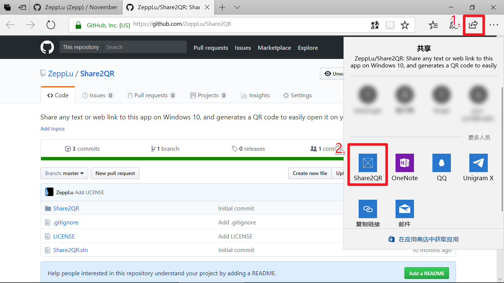
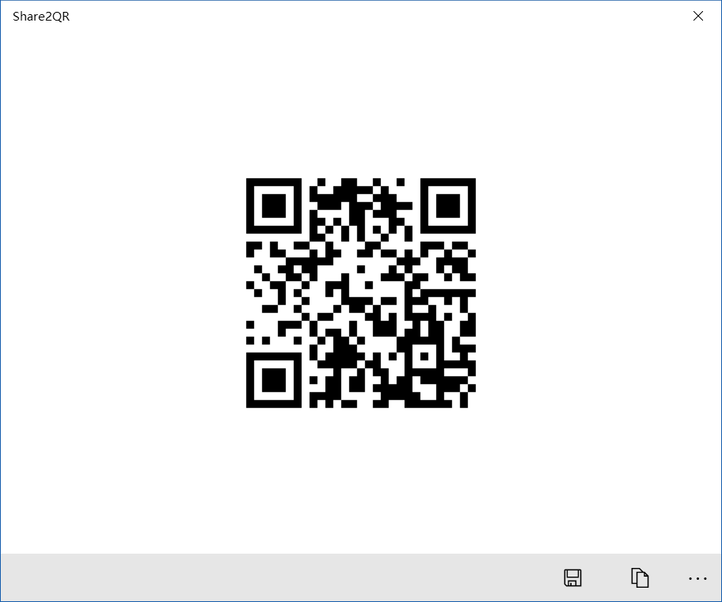

Share to QR-Code
==================

Currently this app has no extra UI other than a simple window,
which is displayed on content sharing.

Then just scan this QR-code with your smart phone, and continue browsing
this website without sitting in front of the PC.

Of course this is not limited to Edge, any UWP support content sharing
should work with Share2QR seamlessly.

Features
-------------
- [x] Accept URL sharing and encode to QR-code
- [x] Accept text sharing and encode to QR-code
- [ ] Accept image sharing, if there's a QR-code, decode it
- [ ] A nice UI displayed on app launched (not content shared), which enable you to encode and decode QR-codes

Compilation
---------------
Visual Studio 2017 Community should bring you all functionality
needed to build this app. And it's **FREE**.
